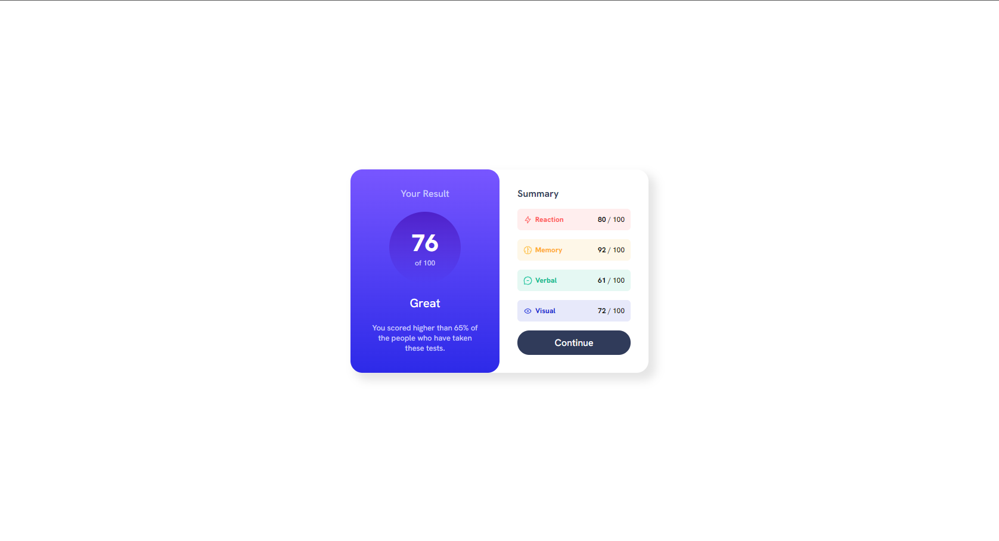
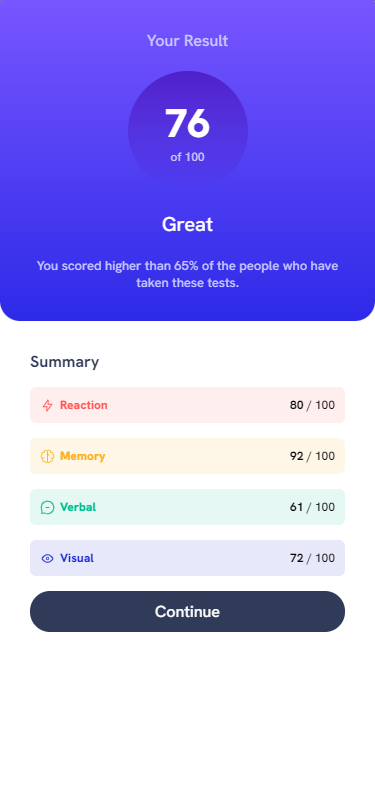

<h1>Preview web page</h1>
</img>
<h1>Preview mobile page</h1>
</img>

<h1 align="center">Results Summary Component Challenge</h1>

  <h3>
    <a href="https://pedrocelotto.github.io/ResultsSummaryComponent-FrontendMentor/" color="white">
      Live
    </a>
     | 
    <a href="https://www.frontendmentor.io/solutions/resultssummarycomponent-challenge-QVMp1lXMfH">
      Solution
    </a>
    | 
    <a href="https://www.frontendmentor.io/challenges/results-summary-component-CE_K6s0maV/hub">
      Challenge
    </a>
  </h3>

   Solution for a challenge from  <a href="https://www.frontendmentor.io/" target="_blank">frontendmentor.io</a>.

 
 
 

## About The Project

Second challenge project. 
Building responsive layouts for mobile and desktop.
The biggest challenge was the way to think about how to fit the section inside the main and how to use @media queries

  Your users should be able to:
 1. View the optimal layout depending on their device's screen size

 
  
I don't have access to the Figma sketch so the design is not pixel perfect.

## Built with

- Semantic HTML5 markup
- CSS custom properties
- Flexbox
- Desktop-first workflow
- Media Queries

## What I learned

Very easy project for someone who recently stepped in the world of development!

## Useful resources

1. <a href="https://chat.openai.com/">ChatGPT</a> - Used to query some html and css properties.

## Acknowledgments

A big thank you to anyone providing feedback on my <a href="https://www.frontendmentor.io/solutions/resultssummarycomponent-challenge-QVMp1lXMfH">solution</a>. It definitely helps to find new ways to code and find easier solutions!
